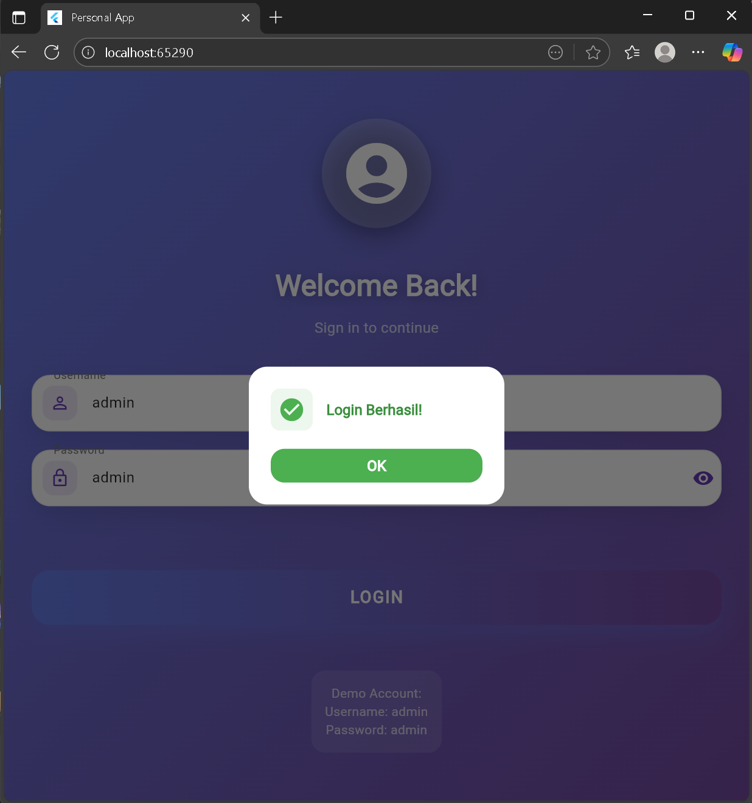
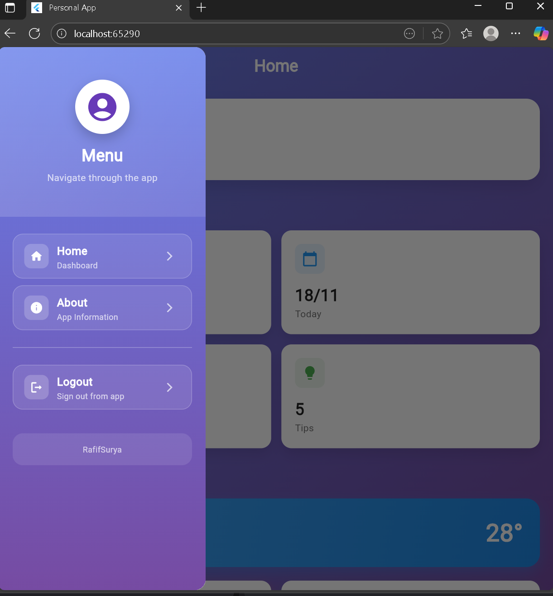
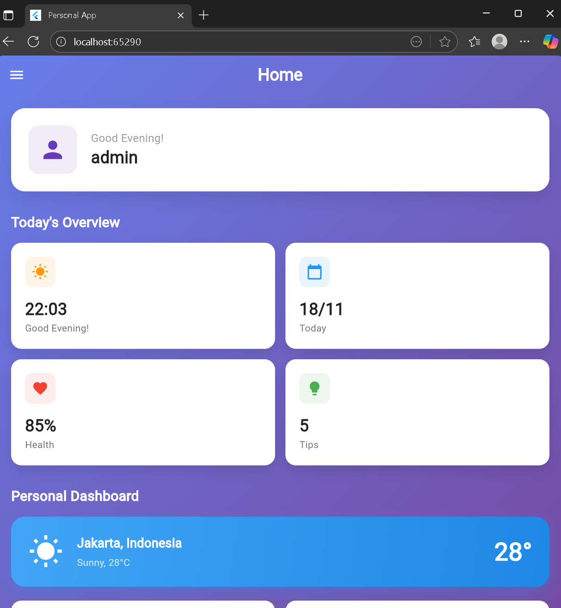
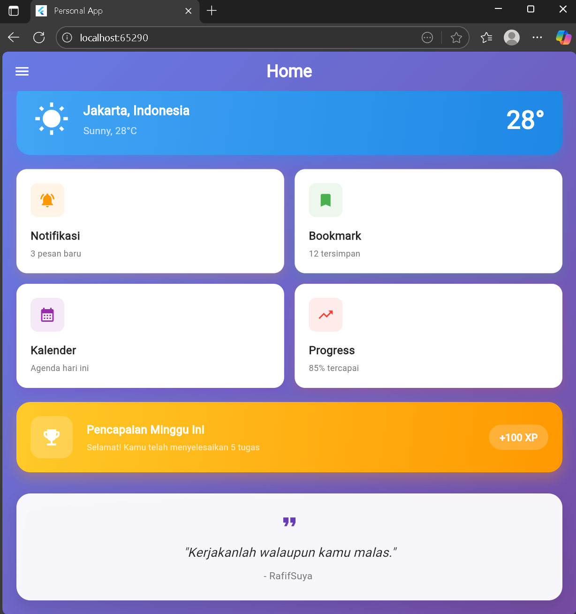
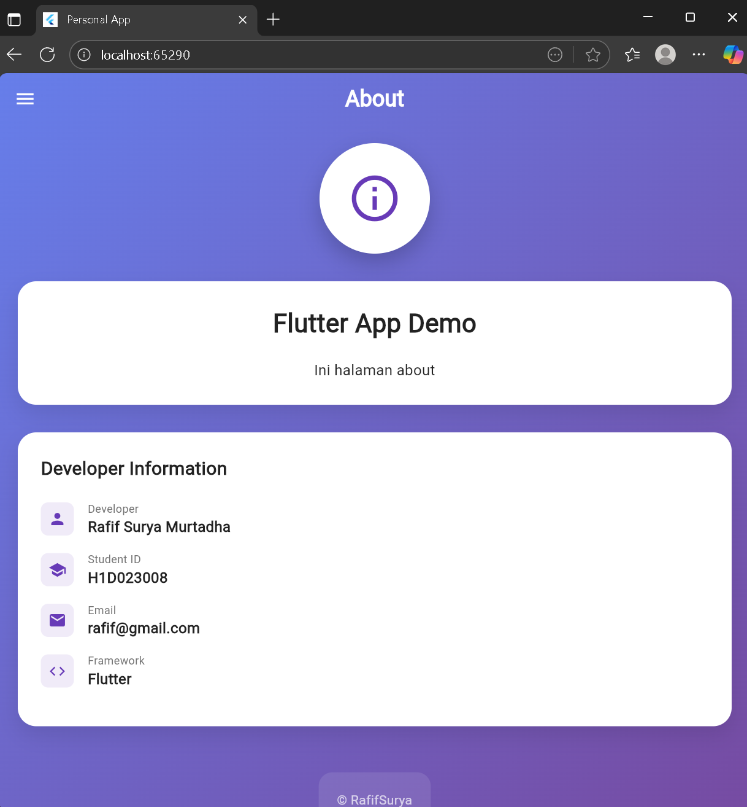

# Tugas 7 Pert 9

## 📝 Penjelasan Kode per Halaman

### **main.dart** - Entry Point
```dart
// Konfigurasi utama aplikasi
- MaterialApp dengan theme setting
- Routing ke LoginPage sebagai halaman awal
- debugShowCheckedModeBanner: false (hilangkan debug banner)
- Theme dengan warna primary
```

### **login_page.dart** - Halaman Autentikasi
```dart
// Halaman login dengan validasi form
- TextFormField untuk username/password
- Validation dengan if-else condition
- SharedPreferences.setBool() untuk save login status
- Navigator.pushReplacement() untuk pindah ke HomePage
- Container dengan gradient BoxDecoration
```

### **homepage.dart** - Dashboard Utama
```dart
// Dashboard dengan fitur interaktif
- AppBar dengan gradient FlexibleSpaceBar
- Drawer untuk side menu navigation
- ListView.builder untuk dynamic content
- GestureDetector untuk tap handling
- showDialog() untuk popup windows
- Image.network() untuk load gambar online
```

### **about.dart** - Halaman Informasi
```dart
// Halaman info developer dalam bentuk cards
- Card widget dengan elevation dan margin
- Column dan Row untuk layout arrangement
- Text widget dengan berbagai style
- Container dengan decoration gradient
- ListTile untuk structured information
```

### **sidemenu.dart** - Navigation Drawer
```dart
// Side menu dengan consistent styling
- Drawer widget sebagai side navigation
- DrawerHeader dengan gradient background
- ListTile untuk menu items
- Navigator.pop() untuk close drawer
- Navigator.pushReplacement() untuk navigate
- showDialog() untuk logout confirmation
```


## 📁 File Structure

```
lib/
├── main.dart           # Entry point aplikasi
├── login_page.dart     # Halaman autentikasi
├── homepage.dart       # Dashboard utama
├── about.dart          # Halaman informasi
└── sidemenu.dart       # Navigation drawer
```


## 👨‍💻 TUGAS

**Nama:** Rafif Surya Murtadha  
**NPM:** H1D023008  
**Mata Kuliah:** Praktikum Pemrograman Mobile  
**Tugas:** 7 - PERTEMUAN 9

---

screensoot:








 


